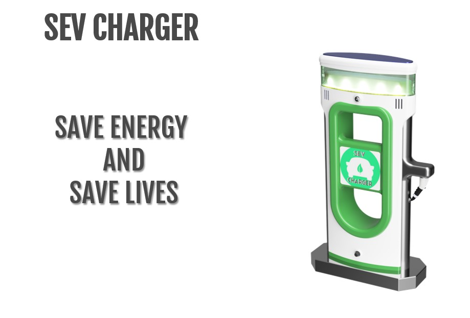
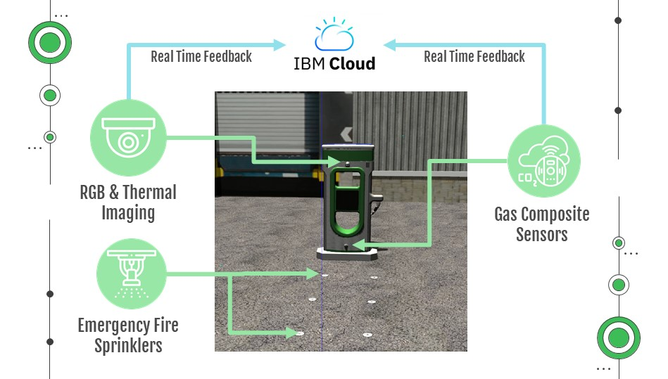
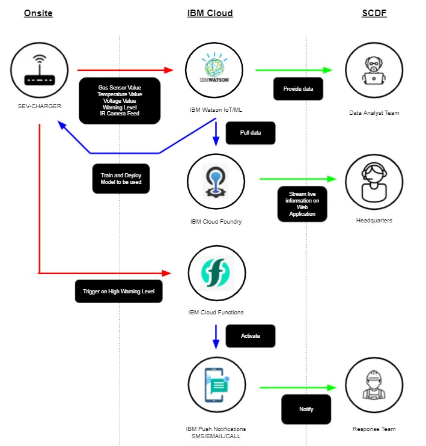
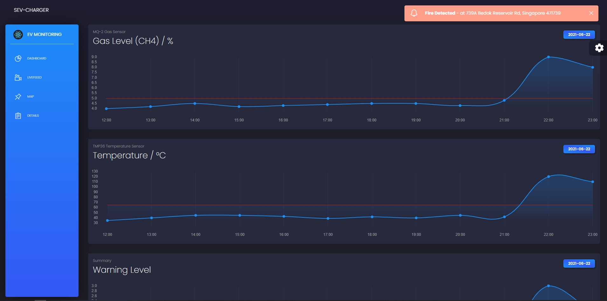
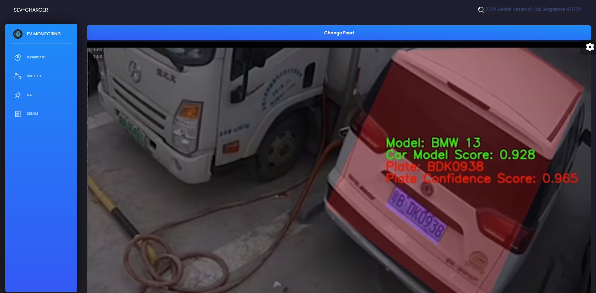
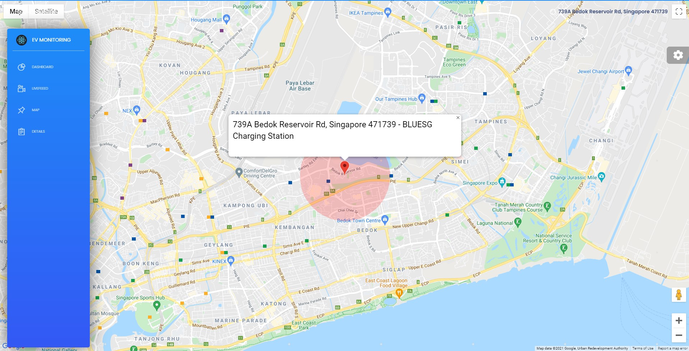
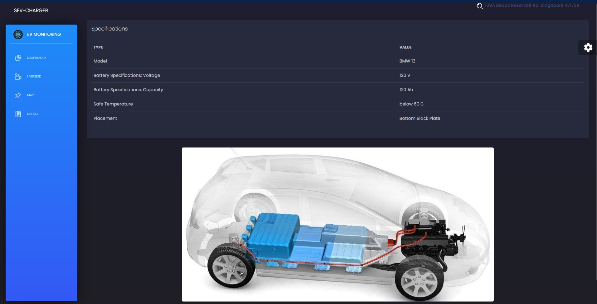

# SCDF SEV-CHARGER
For SCDF Hackathon 2021



## Live Demo Website

The current web application has been hosted in IBM cloud Foundry: https://sev-charger.au-syd.cf.appdomain.cloud/

## Description

With the rising adoption of Electric Vehicle (EV) for green solution in transport, there is also an increase in the number of electric charging spots all around Singapore. 

While the adoption of electric vehicles seems inevitable, the risks of high voltage charging should not be neglected. With the synergy of IOT sensors, AI, and automation, SEV charger is a smart EV charger that enables early and efficient response to high voltage charging fire.

## Explanation

When High Voltage charging is deployed in a mass scale, there could be an increased vulnerability on catching fire and explosion, as well as delayed emergency response due to unmanned charging.

In order to embrace future technologies safely, we need to enhance emergency response, reduce FR’s risk, strategize fire fighting by creating unmanned situation awareness during EV charging fire incidents.

Hence, we would like to propose SEV charger, A smart EV charger that enables early and efficient response to high voltage charging fire.

The charger would be equipped with different IOT sensors such as RGB and thermal imaging, Gas Composite Sensors, and Emergency Fire Sprinkles. The sensors would provide real time feedback through IBM cloud on a remote dashboard.

In the event of a fire incident, emergency signal would be sent out through the dashboard




Including the escalation of a thermal runaway from the battery. Firefighters can also utilize battery information extracted from the car model detected through computer vision algorithms. 


## Pitch Video

Youtube Link: https://www.youtube.com/watch?v=9GieWnIiTo8

## What does this repository contain?

Web Application that live streams the gas (CH4 levels) and temperature sensors value, the warning level, the video feed for IR and RBG as well as the location. To assist the first respondent, the details of the vehicle can be found on the application - ranging from battery placement, vehicle model and voltage source.

## Getting Started

Pull over the entire repository, make a copy of the .env file and populate it with the Google API key. Please activate Google Javascript Map API beforehand.

Subsequently, install all the packages and run start

Follow the steps written below
```shell
git clone https://github.com/Oxiang/SCDF_SEV-CHARGER.git

cd SCDF_SEV-CHARGER

cp .env.template .env

# Fill .env with Google API key

npm install

npm run start

```

## Architecture

The overall architecture is broken down into three different segments: Onsite, IBM cloud and SCDF.



## Solution Services 

### IBM Cloud Services

- IBM Watson for IoT data storage
- IBM Cloud Foundry to host the React Web Application for live-streaming
- IBM Cloud functions as a serverless backend to activate push notification
- IBM Push Notification to send messages to Response Team on high warning level

### Framework

- ReactJs for Web Application
- Possible Flask Server to do future data pre-processing

## SCDF Users Benefits

- Data Analyst working for SCDF are able to tap into the IoT data collected and perform data analytics. This give the team an understanding of the situation for all significant period
- In the Headquarters, SCDF staff are able to monitor and assess the onsite situation from their office and make appropriate decisions
- The Response Team are pre-empt for possible disaster situation and are notified instantly when the disaster strike

## Dashboard



## Livefeed



## Map



## Details



## Team Members

- Ong Xiang Qian
- Tan Wai Hong
- Jack Ng
- Ian Lim
- Goh Ai Fong

## Project RoadMap and Timeline

Our plans is to deploy such systems across locations that are more vulnerable towards fire eruption such as hospitals, manufacturing plants or PSA ports.

The timeline is continue working on the full end-to-end device and testing integration to the current system.
